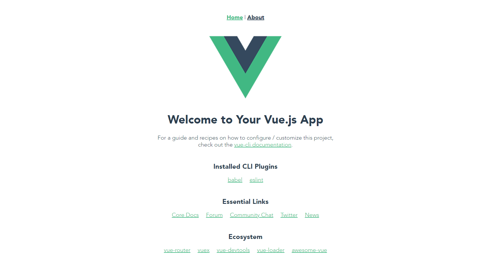

# Part 1

[[toc]]

## 1.1 Install Vue and Vue CLI (version 3)

To make sure you have Vue and the latest version of the Vue CLI installed, type the following into your terminal.

`npm install -g vue @vue/cli`

This installs 2 packages globally: Vue and the Vue CLI.
 

## 1.2 Create a new Vue App

The Vue CLI will allows us to quickly create a Vue project.

To create a new Vue application, you can type the following, replacing the `<app-name>` with the name of your choice. 
vue create `<app-name>`

In this case, I’ll be using `movie-app` as my title, so I’ll type:

`vue create movie-app`

### 1.2.1 Success!

If this command is successful, you should see something like this on your screen:

~~~~

Vue CLI v3.6.3
┌───────────────────────────┐
│  Update available: 3.9.3  │
└───────────────────────────┘

? Please pick a preset:
  default-no-typescript (vuex, node-sass, babel, eslint)
  default (babel, eslint)
> Manually select features

~~~~

### 1.2.2 History mode
~~~~

? Use history mode for router? (Requires proper server setup for index fallback in production) (Y/n) n

~~~~

### 1.2.3 Manually select features

We'll be selecting features manually, so you'll want use the arrow keys to select `Manually select features`

~~~~

? Check the features needed for your project:
 (*) Babel
 ( ) TypeScript
 ( ) Progressive Web App (PWA) Support
 (*) Router
 (*) Vuex
 ( ) CSS Pre-processors
 (*) Linter / Formatter
 ( ) Unit Testing
 ( ) E2E Testing

~~~~

### 1.2.4 ESLint

We'll use `ESLint with error prevention only`

~~~~

? Pick a linter / formatter config:
> ESLint with error prevention only
  ESLint + Airbnb config
  ESLint + Standard config
  ESLint + Prettier

~~~~

### 1.2.5 Lint on save

Choose `Lint on save` if it's not already selected. Don't worry about the `lint and fix` option for now.

~~~~

? Pick additional lint features:
 (*) Lint on save
 ( ) Lint and fix on commit

~~~~

### 1.2.6 Configuration

~~~~

? Where do you prefer placing config for Babel, PostCSS, ESLint, etc.?
  In dedicated config files
> In package.json

~~~~

#### Optional

If you want to reuse these settings on a future app, you can save it as a preset:

~~~~

? Save this as a preset for future projects? (y/N) y

~~~~

### 1.2.7 Lint on save

When you create a new project successfully, you should see the following:

~~~~

Vue CLI v3.6.3
✨  Creating project in C:\Users\jpage\source\repos\movie-app-client\movie-app.
�  Initializing git repository...
⚙  Installing CLI plugins. This might take a while...

~~~~

## 1.3 What did we just do?

We just created a simple, bare-bones app that we can use as our base.

You're app directory should look something like this:

## 1.4 Let's run our app!

If you look in your `package.json`, you should see 3 scripts: `build`, `serve`, and `lint`.

Open a terminal in VS Code or navigate to the directory of your Vue app in Command Prompt.

Type `npm run serve`.

~~~~

> movie-app@0.1.0 serve C:\Users\jpage\source\repos\movie-app-client\movie-app
> vue-cli-service serve

 INFO  Starting development server...
 98% after emitting CopyPlugin 

 DONE  Compiled successfully in 12674ms                                                          9:58:03 PM

  App running at:
  - Local:   http://localhost:8080/
  - Network: http://10.70.242.30:8080/

  Note that the development build is not optimized.
  To create a production build, run npm run build.

~~~~

Open you're browser of choice (I recommend Chrome) and go to 'http://localhost:8080/'.

Voilà! (Or Vuelà)

You should see this:

