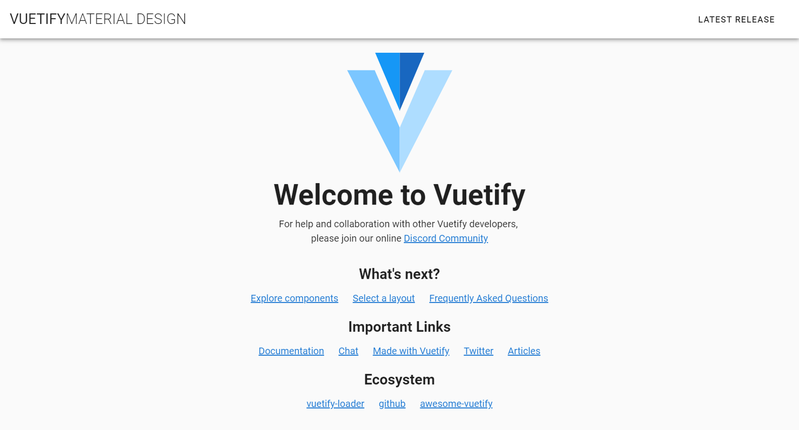

# Part 2

[[toc]]

## 2.1 Adding the Vuetify Plugin

::: tip
Read the Vuetify docs:
[https://vuetifyjs.com/en/getting-started/quick-start](https://vuetifyjs.com/en/getting-started/quick-start)
:::

Use the `vue add vuetify` command to install the Vuetify plugin. You should see this:

~~~~

✔  Successfully installed plugin: vue-cli-plugin-vuetify

? Choose a preset: (Use arrow keys)
> Default (recommended)
  Prototype (rapid development)
  Configure (advanced)

~~~~

Choose `Default (recommended)` from the list of options.

If your installation goes well, your main.js file should look like this:

#### main.js
~~~~ js{4}

import Vue from "vue";
import App from "./App.vue";
import router from "./router";
import store from "./store";
import vuetify from './plugins/vuetify'; // <--- notice that Vuetify has been imported here

Vue.config.productionTip = false;

new Vue({
  router,
  store,
  vuetify, // <--- notice that Vuetify has been included here
  render: h => h(App)
}).$mount("#app");

~~~~

::: warning
Make sure you `npm i` before you try to run your app again. If not, you'll get an error.
`Error: Cannot find module 'vuetify-loader/lib/plugin'`
:::

After running `npm i`, run your app again.

