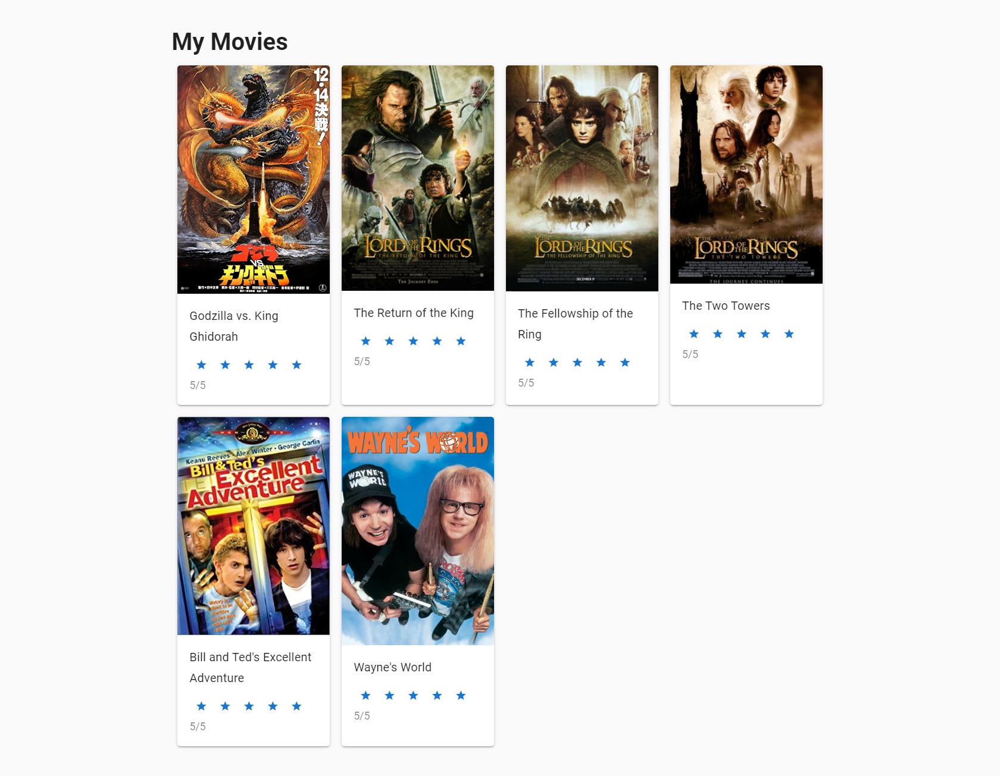
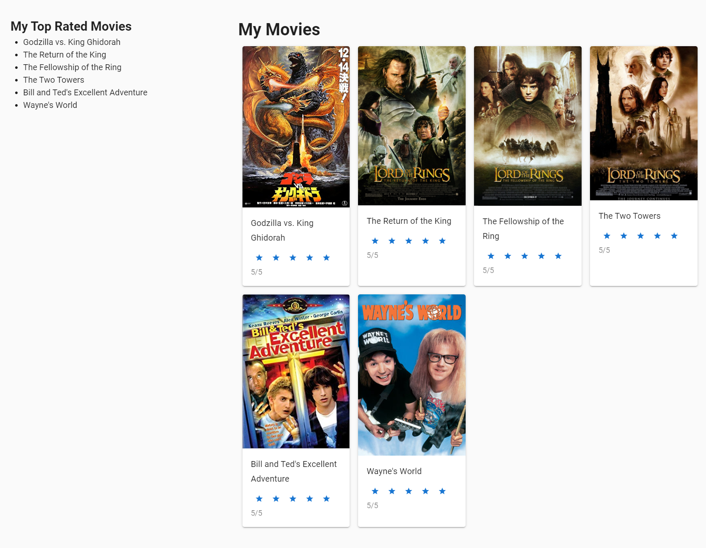

# Part 3
[[toc]]

## 3.1 Working with Vue Files

### 3.1.1 The Anatomy of a Vue File

#### An example of a .vue file
~~~~ vue

<template>
    <!-- HTML here -->
</template>

~~~~

Vue allows us to build components that include markup, script, and style.

#### App.vue
~~~~ vue

<template>
  <HelloWorld /> 
</template>

~~~~

## 3.2 Working on the UI

### 3.2.1 Cleaning up the markup

Let's go ahead and clean out everything except for the `<v-app></v-app>` and `<v-content></v-content>`.

~~~~ vue

<template>
  <v-app>
    <v-content>
    </v-content>
  </v-app>
</template>

~~~~

### 3.2.2 Requesting movie data from an API with Axios

Axios is a promise-based library that allows us to make requests for data more easily.

To install axios `npm i axios` and import is into our `App.vue` script.

I'm also going to add a method to pull data back from `https://movie-api-test-page.herokuapp.com/api/movies`, and call that method when my component is created or added to the DOM.

~~~~ vue

~~~~

### 3.2.3 Showing results in the DOM

Now, you should see the request in your network panel. We just need to do something with this data to display is in the DOM.

I'm going to update the template by adding some Vuetify components into my template.

~~~~ vue

<template>
  <v-app class="app">
    <v-content>
      <v-layout justify-center row wrap fill-height>
        <v-flex xs12 md8 pa-4 fill-height>
          <v-layout justify-left row wrap class="fill-height">
            <v-flex xs12>
              <h1>My Movies</h1>
            </v-flex>
            <v-flex xs6 sm4 md4 lg3 xl3 pa-2 v-for="(m, index) in movies" :key="index">
              <v-card class="fill-height">
                <v-img :src="m.img"/>
                <v-card-title>
                  <h2 class="subtitle-1">{{m.title}}</h2>
                </v-card-title>
                <v-card-text>
                  <v-rating small v-model="m.rating"></v-rating>
                  {{`${m.rating}/5`}}
                </v-card-text>
              </v-card>
            </v-flex>
          </v-layout>
        </v-flex>
      </v-layout>
    </v-content>
  </v-app>
</template>
~~~~

Let's go ahead and add some custom styles!

~~~~

~~~~

### 3.2.4 Results!

After adding this markup, your result should look like this:

### 3.3.1 Add a favorites section

We'll add a favorite's section for everything rated 5 stars.

To do this, we need to update our script and markup.

#### script
~~~~ vue

~~~~

And our template:

~~~~ vue

<template>
  <v-app class="app">
    <v-content>
      <v-layout justify-center row wrap fill-height>
        <v-flex xs12 md4 pa-4>
          <h2>My Top Rated Movies</h2>
          <ul>
            <li v-for="(m, index) in favoriteMovies" :key="index">{{m.title}}</li>
          </ul>
        </v-flex>
        <v-flex xs12 md8 pa-4 fill-height>
          <v-layout justify-left row wrap class="fill-height">
            <v-flex xs12>
              <h1>My Movies</h1>
            </v-flex>
            <v-flex xs6 sm4 md4 lg3 xl3 pa-2 v-for="(m, index) in movies" :key="index">
              <v-card class="fill-height">
                <v-img :src="m.img"/>
                <v-card-title>
                  <h2 class="subtitle-1">{{m.title}}</h2>
                </v-card-title>
                <v-card-text>
                  <v-rating small v-model="m.rating"></v-rating>
                  {{`${m.rating}/5`}}
                </v-card-text>
              </v-card>
            </v-flex>
          </v-layout>
        </v-flex>
      </v-layout>
    </v-content>
  </v-app>
</template>

~~~~

